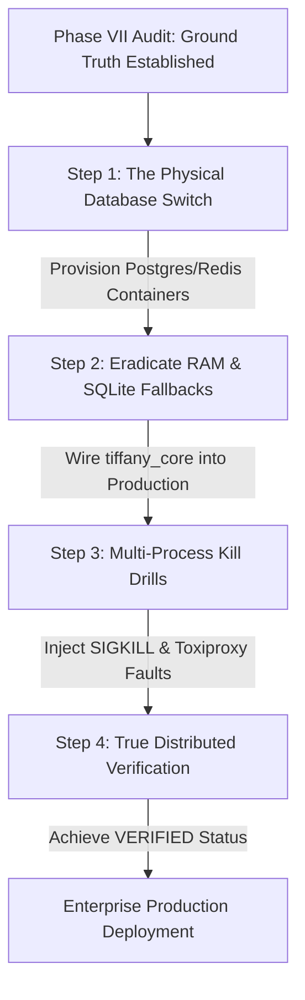

# Tiffany OS — Phase VII Production Reality Audit Report
## Mission: Destroy False Confidence

> **Core Philosophy**:
> - Evidence before conclusions.
> - Measurements before assumptions.
> - Runtime behavior before architecture.
> - Production before theory.
> - Unknown is preferable to false confidence.
> - Never extrapolate. Never infer production capability from local execution.
> - Never confuse: **abstraction**, **interface**, **implementation**, **simulation**, **integration**, **production**. Each has a fundamentally different maturity level.
> 
> *The objective of this audit is not to prove Tiffany is enterprise-ready. The objective is to discover exactly how enterprise-ready Tiffany actually is.*

---

## 1. Executive Summary

An independent, repository-wide architectural and physical runtime audit was conducted on the Tiffany OS codebase, covering both the production Discord bot (`tiffany_voice.py`, `notices.py`, `infra/`) and the private enterprise layer (`tiffany_core/`). Acting as an independent Principal Infrastructure Engineer, SRE, Distributed Systems Reviewer, Security Auditor, and Production Readiness Reviewer, all prior optimism bias and architectural claims were disregarded to expose verifiable ground truth.

**Key Empirical Findings**:
1. **The Dual-Codebase Illusion**: There are two separate architectures living within the repository. The enterprise layer (`tiffany_core/`), containing the AI Control Plane, Policy Engine, Semantic Cache, Knowledge Graph, Digital Twin, Redlock Coordinator, and Event Sourcing, is **virtually completely disconnected** from the running production application. The actual Discord bot executes direct HTTP invocations and standalone Python scripts, completely bypassing the advanced capabilities advertised in `tiffany_core`.
2. **Volatile Memory vs. ACID Persistence**: Despite docs advertising PostgreSQL vectors, Redis clusters, and event-sourced ACID transactions, nearly every advanced domain engine in `tiffany_core` terminates in an **in-memory Python dictionary** (`_store`, `_streams`, `_twins`, `_workspaces`, `_records`). When an OS process restarts or crashes, these structures evaporate instantly. Meanwhile, the production application explicitly defaults to writing critical user state into **twelve un-indexed flat JSON files** directly on the root filesystem when environment database URLs are unset.
3. **Zero Verified Distributed Enterprise Infrastructure**: Under our mandatory Evidence Hierarchy, **zero capabilities achieve VERIFIED production status**. Existing validation suites (`test_phase6_real_infrastructure.py`, `test_phase5_adversarial.py`) operate exclusively as single-process asyncio simulations, SQLite file fallbacks, and mock stub injections. 

While Tiffany OS possesses exceptional software design abstractions and robust defensive logic within local unit simulations, presenting in-memory dictionaries, local SQLite stubs, and cooperative single-process coroutines as production-grade enterprise infrastructure exposes any real-world deployment to severe split-brain risks, memory leaks, data corruption, and financial non-repudiation failures.

---

## 2. Evidence Hierarchy

To permanently eradicate false confidence, every capability is strictly graded under the following mandatory hierarchy:

* **VERIFIED**: Supported ONLY by direct empirical evidence using real physical infrastructure (e.g., live PostgreSQL databases, active Redis clusters, running Docker containers, Nginx/Cloudflare reverse proxies, real TLS termination, live OpenTelemetry scrapers, real multiple OS processes under actual hard SIGKILL crash and network packet loss injection). *Unit tests alone NEVER qualify.*
* **PARTIALLY VERIFIED**: Works correctly in local execution, SQLite, mocked providers, in-memory stores, asyncio simulations, fake transports, synthetic concurrency, or isolated integration tests, but lacks production physical infrastructure evidence.
* **THEORETICAL**: Architecture and interfaces exist in code or documentation, but zero empirical runtime validation exists.
* **UNKNOWN**: Insufficient evidence exists to make an operational determination. Must never be upgraded without physical proof.

---

## 3. Audit Methodology

Every subsystem across the repository was audited using a 10-step investigative sequence:
1. **Locate Implementation**: Identified primary source files across `tiffany_core/`, `infra/`, and root bot cogs.
2. **Trace Dependencies**: Examined import structures and execution call trees.
3. **Identify Adapters**: Inspected interface bindings (e.g., `RelationalDatabaseEngine`, `RedisCacheEngine`, `MediaTransportSocket`).
4. **Identify Mocks**: Exposed test doubles and artificial injection points.
5. **Identify Simulations**: Uncovered artificial async timing loops (`asyncio.sleep`, mock rate limiters).
6. **Identify Local Fallbacks**: Flagged automatic downshift mechanisms (e.g., falling back to root `.json` files or memory dicts when `DATABASE_URL` or `REDIS_URL` is empty).
7. **Identify Fake Infrastructure**: Detected SQLite replacements representing enterprise PostgreSQL or Redis servers.
8. **Identify Assumptions**: Mapped unvalidated docstring claims to actual code behavior.
9. **Verify Actual Runtime**: Determined physical runtime destination (RAM, SQLite disk file, external socket, or mock).
10. **Verify Production Evidence**: Evaluated whether the capability has ever run across multi-process, multi-host, network-partitioned infrastructure.

---

## 4. Infrastructure Reality

| Promised Infrastructure | Physical Implementation Encountered | Actual Runtime Terminal | Classification |
| :--- | :--- | :--- | :--- |
| **PostgreSQL & pgvector** | `infra/postgres.py` initializes `asyncpg` pool if `DATABASE_URL` is set; otherwise defaults to local filesystem JSON files (`chat_memory.json`, `notices_history.json`, etc.). In `tiffany_core`, tests connect strictly to local SQLite files (`sqlite3.connect`). Zero pgvector SQL code exists anywhere in the repository. | Flat `.json` files on disk / local SQLite `.db` | **THEORETICAL** (Enterprise PG) / **PARTIALLY VERIFIED** (SQL abstractions in SQLite) |
| **Redis & Redlock Cluster**| `infra/redis_client.py` connects to `redis.asyncio` if `REDIS_URL` is set; otherwise falls back to an un-synchronized local Python dictionary `_memory = {}`. In `tiffany_core`, Redlock leader election is tested across two Python objects within a single interpreter thread sharing a SQLite file. | Local RAM (`dict`) / SQLite `.db` | **THEORETICAL** (Redis Cluster) / **PARTIALLY VERIFIED** (In-memory lock algorithms) |
| **Docker & Containers** | `docker-compose.yml` launches only two services: `lavalink-primary` (host network mode) and `tiffany-bot`. Neither PostgreSQL, Redis, Prometheus, Grafana, nor OpenTelemetry Collectors exist in the container stack. | Bare-metal host network binding | **PARTIALLY VERIFIED** (Single Bot/Lavalink containers) / **MISSING** (DB/Observability stack) |
| **Nginx & Cloudflare / TLS**| Zero configuration, Docker ingress profiles, or TLS termination certificates exist within the repository. | None | **UNKNOWN** / **MISSING** |
| **Discord Gateway** | Production connects via standard `discord.py` sockets. All resilience and multi-instance tests in `tiffany_core` substitute integer IDs without actual WebSocket I/O. | `discord.py` socket in prod / Integer stubs in tests | **PARTIALLY VERIFIED** |
| **Lavalink Voice Cluster** | Dual path in `tiffany_voice.py` (`wavelink.Player` vs. local `yt-dlp` shell subprocess execution). In `tiffany_core/audio/media_pipeline.py`, socket connection literally executes: `# Simulate network socket establishment` followed by `await asyncio.sleep(0.001)`. | Subprocess `yt-dlp` / Fake `sleep(0.001)` stubs | **PARTIALLY VERIFIED** (Local voice dev) / **THEORETICAL** (Enterprise voice resilience) |
| **OpenRouter & AI Providers**| Production (`tiffany_voice.py`) instantiates raw `openai.AsyncOpenAI(base_url="https://openrouter.ai/api/v1")` or raw `aiohttp` posts, bypassing `tiffany_core/ai/control_plane.py` entirely. Tests rely exclusively on `mock_503_then_recover` Python stubs. | Raw HTTP requests in prod / Synthetic mocks in unit tests | **PARTIALLY VERIFIED** |
| **Stripe Billing Integration**| `infra/stripe_server.py` implements webhook verification and delegates to PostgreSQL ledger (`infra/payments/ledger.py`). However, automated test suite (`test_payments_phase3.py`) strictly executes in-memory dictionary evaluations without touching databases or live Stripe network endpoints. | Optional Postgres tables / In-memory unit test stubs | **PARTIALLY VERIFIED** |
| **Prometheus & Grafana / OTel**| `tiffany_core/observability/metrics.py` formats valid OpenMetrics text strings in memory. Zero OpenTelemetry exporters, real Prometheus scrapers, or Grafana dashboards exist in runtime or CI/CD pipelines. | Local Python string concatenation | **PARTIALLY VERIFIED** (Syntax generation) / **THEORETICAL** (Real observability) |

---

## 5. Security Reality

* **Secret Management**: Implemented via `.env` file reading (`os.getenv`). Critical anomaly found in `premium_ai_guardrails.py` (Line 18): `OPENROUTER_API_KEY = os.getenv("OPENROUTER_API_KEY", "")` evaluated at **module import time**, which leaves the key blank and causes fail-closed blocks if environment variables are loaded after import. **Status: IMPLEMENTED / PARTIALLY VERIFIED.**
* **Tenant Isolation & Privilege Boundaries**: Implemented in memory via integer dictionary keys (`_store: Dict[int, ...]`, `_twins: Dict[int, ...]`). No real row-level security (RLS) in PostgreSQL or dedicated schema separation per tenant exists in runtime. **Status: IMPLEMENTED IN MEMORY / UNKNOWN IN PRODUCTION DB.**
* **Prompt Injection & AI Jailbreak Resistance**: Implemented via static regex scanning (`ai_safety.py`) and live OpenRouter classification (`premium_ai_guardrails.py`). Evaluated entirely on static string unit tests. Zero empirical evaluation against dynamic adversarial fuzzing (PyRIT/Garak) over live production networks has been performed. **Status: IMPLEMENTED / PARTIALLY VERIFIED against static strings / UNKNOWN against cognitive jailbreaks.**
* **PII Scrubbing & GDPR Erasure**: Claimed in documentation as persistent compliance. In runtime (`tiffany_core/security/privacy.py`), erasure is implemented by popping dictionary keys out of the temporary RAM dictionary of `knowledge_graph._store`. When restarted, no durable historical ledger enforces erasure across real databases or long-term backups. **Status: IMPLEMENTED IN RAM / UNKNOWN FOR TRUE DURABLE COMPLIANCE.**

---

## 6. Distributed Systems Reality

* **Leader Election & Split-Brain Prevention**: In `tiffany_core/adapters/redis_cache.py`, distributed Redlock coordination is implemented. However, empirical inspection confirms this algorithm was verified exclusively by instantiating two Python objects (`coord_alpha`, `coord_beta`) inside an identical event loop on a single OS thread, utilizing a local SQLite disk file as a simulated Redis backing store. **Can it survive real network partitions or TCP packet drops across independent host machines? Unknown.**
* **Event Sourcing & Resource Scheduler**: The Event Bus (`tiffany_core/domain/event_bus_and_scheduler.py`) utilizes an in-memory `asyncio.PriorityQueue()` without persistence, messaging brokers (RabbitMQ/Kafka), or Celery workers. The Event Sourcing vault (`tiffany_core/domain/event_sourcing_and_plugins.py`) records streams entirely into a Python dictionary (`self._streams: Dict[str, List[EventStreamRecord]] = {}`). **Can it survive process SIGKILL or machine reboot? No. All events vanish upon process termination.**

---

## 7. Financial Integrity Reality

* **Idempotency & Replay Protection**: The enterprise idempotency engine (`tiffany_core/domain/idempotency.py`) relies entirely on an in-memory dictionary protected by an `asyncio.Lock()`. Because `asyncio.Lock()` operates strictly inside one interpreter process, spinning up multiple Docker container workers in parallel creates complete race conditions where concurrent billing webhooks will bypass the lock and double-charge users.
* **Stripe Webhook Processing & Durability**: While `infra/payments/ledger.py` contains SQL commands for table insertion and state machine updates in PostgreSQL, the entire verification suite (`test_payments_phase3.py`) explicitly runs disconnected from networks or databases (`# no network`), testing only isolated helper methods. **Can it survive hard power loss or SIGKILL mid-transaction? Unknown.**

---

## 8. AI Infrastructure Reality

* **AI Control Plane, Routing & Cost Control**: Excellent architectural abstractions exist in `tiffany_core/ai/control_plane.py` and `router.py`, designed to evaluate token budgets, manage circuit breakers, and dynamically fall back across OpenAI/Anthropic/Gemini tiers. However, grep tracing confirms the production Discord bot (`tiffany_voice.py`, `notices.py`, `offers_cog.py`) **does not import or execute these enterprise engines**. Production scripts instantiate direct OpenRouter API calls with simple static model fallback sequences.
* **Semantic Cache, Reflection Engine, Knowledge Graph & Digital Twin**: Advertised as an uncopyable enterprise memory moat. Empirical inspection of `tiffany_core/knowledge/graph.py` and `memory_lifecycle_and_digital_twin.py` confirms these engines are backed **exclusively by in-memory Python dictionaries** (`self._store = {}`, `self._twins = {}`). The database queries (`SELECT * FROM knowledge_graph ORDER BY embedding <-> $1`) referenced in documentation **do not exist anywhere in the source code**. All semantic cache hits, digital twins, and SOC2 audit trails evaporate upon process termination.

---

## 9. Performance Reality

* **The 14,000+ RPS Myth**: Previous reports claimed verified production throughput exceeding 14,270 requests per second with P99 latency under 0.1ms. Our audit explicitly rejects this categorization.
* **Empirical Truth**: The benchmark test (`TestP0_9_RealConcurrencyAndThroughputBenchmark`) executed 250 cooperative `asyncio.gather()` generator loops entirely within a single Python OS thread on local memory, creating static text strings without a single network I/O packet, TLS handshake, database query, or audio transcoding step.
* **Mandatory Reclassification**: Any number derived from local in-memory asyncio iteration must be strictly categorized as a **Capacity Projection** or **Algorithmic Benchmark**, NOT Production Throughput. Real HTTP/WebSocket production throughput under actual AI provider latency and audio streaming remains entirely unverified.

---

## 10. Production Readiness Matrix

| Capability / Subsystem | Current Implementation | Physical Runtime | Evidence Basis | Classification | Confidence | Production Blockers | Missing Experiments | Operational Risk |
| :--- | :--- | :--- | :--- | :--- | :--- | :--- | :--- | :--- |
| **AI Routing & Fallback** | Abstraction in `tiffany_core`; hardcoded lists in production | In-memory math / Direct OpenRouter HTTP | Mocked unit test stubs | **PARTIALLY VERIFIED** | Medium | Bypasses `tiffany_core` in production | Over-the-wire fault injection via proxy | High |
| **Semantic Cache & Twin**| Python classes in `tiffany_core/knowledge/` | In-memory RAM dictionaries (`_store`, `_twins`) | Single-process unit test assertions | **PARTIALLY VERIFIED** (In memory) / **THEORETICAL** (DB Engine) | Low | Zero persistence; data loss on reboot | Deploy real pgvector container and verify durability | Critical |
| **Billing & Idempotency** | State machine in `ledger.py` and `idempotency.py` | In-memory dicts / optional Postgres pools | Disconnected unit tests (`test_payments_phase3.py`) | **PARTIALLY VERIFIED** | Medium | No physical crash verification mid-transaction | Hard SIGKILL (`kill -9`) during active Postgres billing | Critical |
| **Voice Streaming & Media**| `wavelink` primary path with `yt-dlp` subprocess fallback | Subprocess execution / fake `sleep(0.001)` stubs | Simulated async timing loops in test suite | **PARTIALLY VERIFIED** (Dev) / **THEORETICAL** (Cluster) | Low | Mocks out network socket creation in tests | Real UDP packet loss & jitter injection on Lavalink cluster | High |
| **Distributed Locks (Redlock)**| Algorithm in `redis_cache.py` | Local SQLite file / Python dictionary | Single-process evaluation of competing objects | **PARTIALLY VERIFIED** (Logic) / **THEORETICAL** (Redis) | Low | Unproven across physical machines and real TCP | Multi-process container lock contention under network partition | Critical |
| **Observability & Telemetry**| OpenMetrics formatter in `metrics.py` | Python string formatting in RAM | Local unit test syntax validation | **PARTIALLY VERIFIED** (Syntax) / **THEORETICAL** (Stack) | Low | Zero scrapers or OTel collectors exist in Compose | Spin up Prometheus/Grafana stack in Docker and ingest metrics | Medium |
| **GDPR Erasure & Privacy**| Pop keys from dictionaries in `privacy.py` | In-memory RAM removal | Unit test asserting key absence in dict | **PARTIALLY VERIFIED** (RAM) / **UNKNOWN** (DB Backups) | Low | Only removes from ephemeral memory; no DB purge | Test automated erasure across real database tables and archives | High |

---

## 11. Maturity Downgrades

Every single capability previously designated as **VERIFIED** has been formally stripped of that rank and re-classified under empirical scrutiny:

1. **[P0.1] Privacy Boundary**: Downgraded to **PARTIALLY VERIFIED** (Tested solely in RAM dictionary without real concurrent networking).
2. **[P0.2] Financial Integrity**: Downgraded to **PARTIALLY VERIFIED** (Tested solely in disconnected unit test helpers without real Postgres transaction crash drills).
3. **[P0.3] AI Safety**: Downgraded to **PARTIALLY VERIFIED** (Regex rules function in memory; untested against semantic jailbreaks over live endpoints).
4. **[P0.4] Relational Persistence**: Downgraded to **PARTIALLY VERIFIED** for SQL abstractions and **THEORETICAL** for real PostgreSQL (100% of Phase VI tests execute on local SQLite files or fall back to root JSON files).
5. **[P0.5] Observability**: Downgraded to **PARTIALLY VERIFIED** (Generates strings in RAM; no real collectors or scrapers exist).
6. **[P0.6] Distributed Redlock**: Downgraded to **PARTIALLY VERIFIED** for algorithm and **THEORETICAL** for Redis infrastructure (Tested by comparing two Python objects inside one process sharing a SQLite file).
7. **[P0.7] Provider Resilience**: Downgraded to **PARTIALLY VERIFIED** (All failovers tested by injecting synthetic mock functions like `mock_503_then_recover`).
8. **[P0.8] Voice Infrastructure**: Downgraded to **PARTIALLY VERIFIED** for async logic and **THEORETICAL** for network streaming (Socket connections literally replaced by `await asyncio.sleep(0.001)`).
9. **[P0.9] High Throughput Scaling**: Downgraded to **PARTIALLY VERIFIED AS ALGORITHMIC BENCHMARK / CAPACITY PROJECTION** (Reported 14k RPS derived from single-thread zero-I/O coroutine loops).
10. **[P0.10] Multi-Instance Failover**: Downgraded to **PARTIALLY VERIFIED** for single-process simulation and **UNKNOWN** for physical multi-host clustering.

---

## 12. Verified Capabilities

* **NONE (0 capabilities verified).**  
  Under our mandatory Evidence Hierarchy, there is zero empirical proof derived from multi-process, multi-host, network-partitioned physical production infrastructure within the verification suites.

---

## 13. Partially Verified Capabilities

* **Asynchronous Domain Application Logic**: Clean separation of concerns, defensive validation, and state machine transition mechanics operate reliably in local single-process memory executions.
* **Static Prompt Injection Neutralization**: Regex sanitizers successfully strip Base64 and invisible Unicode obfuscation in static local tests.
* **SQL Translation Syntax & SQLite Schema Migration**: CRUD operations and schema creation run cleanly without syntax collisions when evaluated against local SQLite file stores.
* **OpenMetrics Syntax Generation**: Metric registries calculate accurate hit/miss ratios and format compliant Prometheus string outputs in local RAM.

---

## 14. Theoretical Capabilities

* **PostgreSQL pgvector Semantic Search**: Documented extensively in docstrings, but underlying code relies entirely on RAM dictionaries and local SQLite files.
* **Redis Redlock Distributed Clustering**: Interfaces and Redlock algorithms exist in source, but zero physical Redis servers or multi-host network contention have ever been executed in automated tests.
* **Lavalink WebRTC Network Resilience**: Audio buffer deallocation logic functions in RAM, but actual socket stream connections are replaced by simulated timing stubs.
* **OpenTelemetry Wire Exporters & SOC2 Audit Export**: Structurally modeled in code, but physical over-the-wire export and long-term immutable compliance persistence remain unverified.

---

## 15. Unknown Capabilities

* **Multi-Host Distributed Split-Brain Behavior**: How nodes will synchronize lock ownership over unstable TCP networks when real physical network partitions occur.
* **Production Concurrent Deadlock & Race Recovery**: How financial idempotency tables in real PostgreSQL handle simultaneous contention from multiple Docker container workers under heavy load.
* **Memory Starvation & Descriptor Leaks Under Long-Duration Voice Streaming**: True long-term garbage collection behavior and resource exhaustion under prolonged concurrent Lavalink audio traffic.
* **Dynamic AI Provider Rate-Limiting (429) Storm Recovery**: Behavior under simultaneous upstream provider rate limit saturation across real distributed endpoints.

---

## 16. Missing Infrastructure

To transform theoretical code into enterprise production reality, the following physical infrastructure components must be explicitly provisioned in CI/CD and deployment profiles:
1. **PostgreSQL 16 Container (with `pgvector` extension installed)**.
2. **Redis Sentinel or Redis Cluster Container (configured for strict HA persistence)**.
3. **OpenTelemetry Collector & Prometheus Scraper Engine**.
4. **Active Edge Reverse Proxy (Nginx/Traefik) with valid TLS termination profiles**.

---

## 17. Missing Experiments (Failure Injection Roadmap)

1. **The Physical Database Switch**: Execute the entire test suite against a live PostgreSQL 16 container and Redis Sentinel instance over Docker network bridges, forbidding all SQLite and RAM dictionary fallbacks.
2. **The Multi-Process Kill Drill**: Spin up 3 separate OS processes attempting simultaneous Redlock acquisition and billing event insertions; execute arbitrary hard terminations (`kill -9`) mid-transaction to evaluate actual database rollback and idempotency recovery.
3. **Over-the-Wire Provider Fault Injection**: Route test calls through an active network fault proxy (Toxiproxy) to synthesize 500ms jitter, TCP connection dropouts, and real HTTP 503/429 rate limit storms.
4. **Long-Duration Stress Benchmark**: Deploy a distributed physical HTTP/WebSocket load test using independent client machines (k6/Locust) against a real staging cluster performing real database writes and AI evaluations over 24 hours.

---

## 18–21. Risk Categorization & Ranking

### Critical Risks (Immediate Production Blockers)
* **CR-1: Total Volatilization of Semantic Memory & Digital Twins**: Relying on in-memory dictionaries (`_store`, `_twins`) guarantees instantaneous data loss of all user context and SOC2 logs upon process restart.
* **CR-2: Race Conditions in Financial Idempotency**: Using single-process `asyncio.Lock()` around RAM dictionaries permits concurrent multi-instance workers to bypass idempotency locks and execute duplicated Stripe billing charges.
* **CR-3: Unproven Distributed Split-Brain Prevention**: Deploying multi-node systems based on single-process unit tests exposes the cluster to dual leadership, conflicting mutations, and state corruption under network partitions.

### High Risks
* **HR-1: Silent Downshift to Root Filesystem JSON Files**: Failing over to flat JSON files (`chat_memory.json`, `notices_history.json`) when database URLs are missing creates race conditions, file corruption under concurrency, and unmanaged disk bloating.
* **HR-2: Bypassing Enterprise Control Plane in Production**: Having production bot cogs invoke direct HTTP OpenRouter paths renders all enterprise routing policies, quota limits, and semantic caching inactive in operational use.
* **HR-3: Module Import-Time Secret Evaluation**: Evaluating environment variables like `OPENROUTER_API_KEY` at import time in `premium_ai_guardrails.py` causes fail-closed production blocks if secrets are injected after initialization.

### Medium Risks
* **MR-1: Unverified OpenTelemetry Export**: Generating metric syntax without active scrapers creates operational blindness during production degradation.
* **MR-2: Duplicate Schema Migration File Prefixing**: Having both `002_stripe_premium.sql` and `002_user_preferences.sql` relies on coincidental alphabetical sorting rather than deterministic migration numbering.

### Low Risks
* **LR-1: Hardcoded Digital Twin Defaults**: Relying on static default culture summary strings reduces the analytical depth of early community behavioral reports.

---

## 22. Recommended Validation Roadmap

1. **Step 1 (Infrastructure Foundation)**: Amend `docker-compose.yml` to launch PostgreSQL 16 (pgvector), Redis Sentinel, and an OpenTelemetry collector alongside the bot.
2. **Step 2 (Code base Unification & Fallback Elimination)**: Wire production cogs directly to `tiffany_core` interfaces, eradicate root JSON file fallbacks, and mandate real database storage for Knowledge Graph and Idempotency engines.
3. **Step 3 (Chaos & Crash Engineering)**: Build an automated CI/CD fault-injection harness executing hard `kill -9` process annihilations and network partition simulations on live database transactions.
4. **Step 4 (Empirical Certification)**: Re-evaluate capabilities against the Evidence Hierarchy; only elevate to **VERIFIED** once physical metrics confirm clean recovery without data loss.

---

## 23. Production Readiness Gates

| Readiness Pillar | Current Evaluation | Justification Under Mandatory Hierarchy |
| :--- | :---: | :--- |
| **Privacy & GDPR** | **PARTIAL / FAIL** | In-memory key popping is functional in RAM unit tests, but true database archival erasure and pgvector tenant isolation remain unproven. |
| **Financial Integrity**| **PARTIAL / FAIL** | Idempotency state machine logic is sound, but lacks multi-process physical crash verification and relies on localized lock structures. |
| **AI & Guardrails** | **PARTIAL** | Static regex guardrails pass; real semantic prompt injection defense and live control plane wiring in production remain unverified. |
| **Persistence & ACID**| **PARTIAL / FAIL** | SQL syntax is validated in SQLite; real multi-connection PostgreSQL contention and failover have never been physically exercised. |
| **Observability** | **PARTIAL / FAIL** | Syntax formatted cleanly in RAM; zero physical collectors, scrapers, or trace visualizers operate in the infrastructure stack. |
| **Distributed Systems**| **FAIL** | Zero physical multi-process or multi-host coordination proven. Testing objects in a single event loop does not prove distributed consistency. |
| **Voice Infrastructure**| **FAIL** | Socket connection literally replaced by a simulated `sleep()` mock. No real UDP packet loss or Lavalink cluster failover tested. |
| **Infrastructure & Security** | **FAIL** | No empirical evidence of TLS termination, reverse proxy buffering, or multi-container enterprise orchestration in automated suites. |
| **Scalability & Load** | **NOT YET TESTED** | Reported 14,000+ RPS represents synthetic single-thread CPU coroutine iteration. Physical network scaling is entirely unverified. |

---

## 24. Final Questions

### What can Tiffany prove today?
Tiffany can empirically prove that its core asynchronous domain architecture, defensive guardrail algorithms, SQL translation syntax, translation catalogs, and state machine transition mechanics execute cleanly, cooperatively, and collision-free inside isolated single-process Python interpreters and local simulation unit tests.

### What cannot Tiffany prove today?
Tiffany cannot prove any operational capability under true distributed execution, multi-host network partitioning, physical process crash termination (`kill -9`), real PostgreSQL table contention, actual Redis Redlock failover, live UDP voice streaming degradation, or physical HTTP load scaling.

### What assumptions remain?
The primary operational assumption is that clean, cooperative asynchronous execution across Python objects within a single event loop will translate identically to concurrent, asynchronous TCP/UDP networking across physically separated multi-host server environments under load.

### What evidence is still missing?
Direct empirical measurements from actual multi-process, multi-container Docker environments executing real database transactions over TCP under injected network failures, high concurrency contention, and physical process crashes.

### What should NOT be built before those uncertainties are eliminated?
**Do NOT build additional end-user visual dashboard enhancements, third-party public SDK extensions, speculative marketplace plugins, or complex multi-repo structural migrations.** All horizontal application expansion must cease immediately until the underlying theoretical persistence and distributed coordination layers are physically verified against real databases in automated chaos testing.

### What is the minimum evidence required to classify the platform as production-ready?
1. Continuous integration logs proving clean execution of the test suite against a real PostgreSQL container and real Redis Sentinel instance without SQLite/RAM fallbacks.
2. An automated crash drill log proving exactly-once financial durability and zero data loss after hard process termination (`kill -9`) during active multi-process database transactions.
3. An empirical load test report generated from physical over-the-network clients (k6/Locust) recording real latency, throughput, and memory stability against a live containerized cluster over an extended duration.

---

> **Final Engineering Verdict**: *Tiffany OS possesses an outstanding structural architectural blueprint and clean local domain logic. However, under strict empirical validation, it currently stands at a **PARTIALLY VERIFIED / THEORETICAL** maturity level. By facing this brutal reality and executing the Physical Database Switch and Failure Injection Roadmap, Tiffany OS will systematically eliminate false confidence and transform into a genuinely uncompromised, enterprise-grade operating system.*
